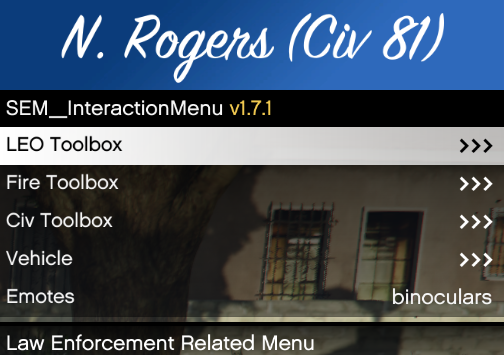
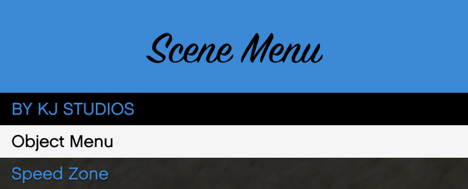
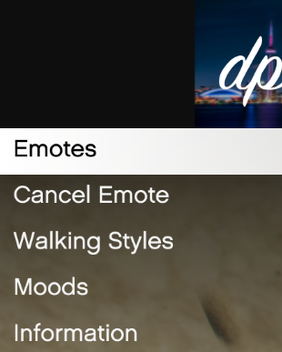

# Menus you will encounter

## F5 Menu

This is where you will make your character, vehicles as well as adjust your voice chat settings

## M Menu

This menu is used for civilian actions ie: Hands up, Hands up kneel

## Props Menu

You can access this by pressing " Y "

This Menu is where props are spawned and speed zones set

## Emote Menu

You can access this by pressing " F9 " or typing "Emotemenu" in chat

This is where all emotes are stored and accessed